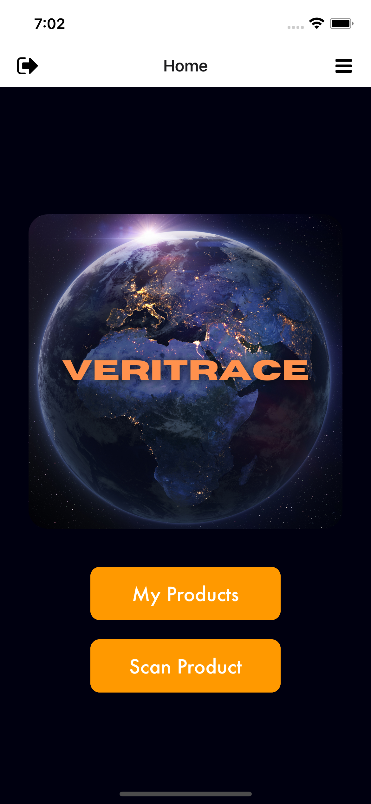
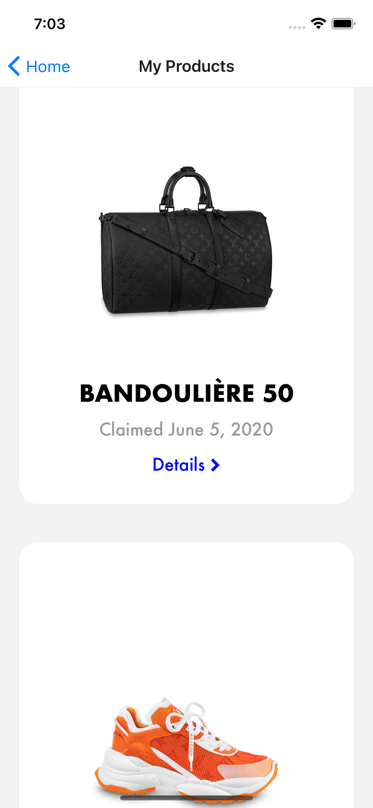
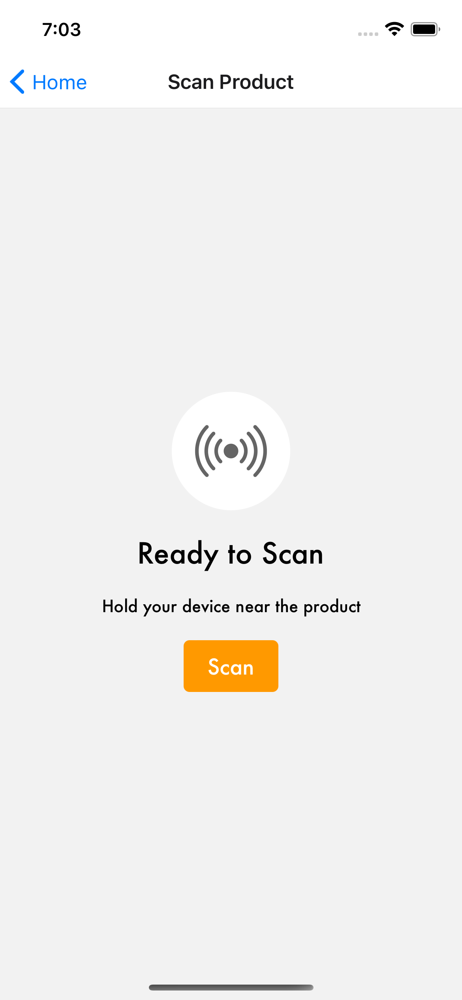
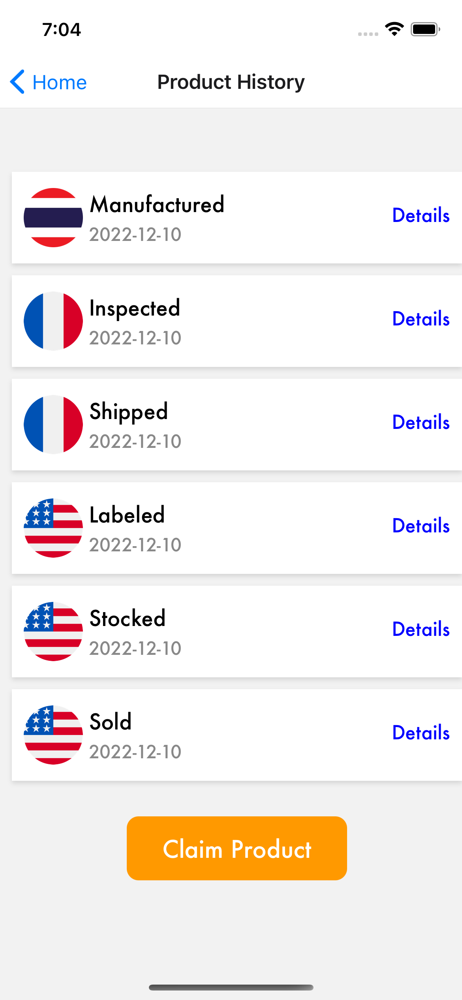
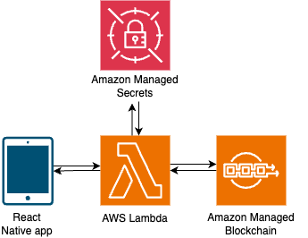

## Overview
Counterfeit products cost brands billions annually. This mobile application allows users to verify the authenticity of products embedded with RFID chips. By scanning a product's chip, the consumer can confirm product legitimacy and track its journey through the manufacturing and distribution process. The solution leverages blockchain technology to ensure the integrity and immutability of product data.

### Features
- **RFID Scanning**: Easily scan products with embedded RFID chips
- **Authenticity Verification**: Instantly confirm product legitimacy
- **Manufacturing Journey**: View the product's path through various checkpoints
- **Blockchain Integration**: Ensure data integrity and immutability
- **User-Friendly Interface**: Simple and intuitive design for all users

### Technologies used
- React Native
- `react-native-nfc-manager`
- Amazon Web Services (Lambda function, Amazon Managed Secrets, Amazon Managed Blockchain)

## How it works
1) Companies embed RFID chips in their products
2) Products are scanned at each manufacturing and distribution checkpoint
3) Each scan creates a blockchain transaction, recording the product's journey
4) Consumers download the app and scan purchased products
5) The app displays authenticity status and the product's blockchain-verified journey

## Architecture

1) User scans RFID chip-embedded product using the mobile app
2) Scan event triggers API call to Lambda to find transactions related to the scanned product
3) Lambda retrieves credentials from AWS Secrets Manager and queries product data from the HyperLedger Fabric blockchain.
4) Lambda then returns the query response from the blockchain network to VeriTrace. 

_Note: You must build/deploy your own Lambda function, Amazon Managed Secrets, and blockchain to integrate with this front-end._

   

## Support
For questions or support, please open an issue.
